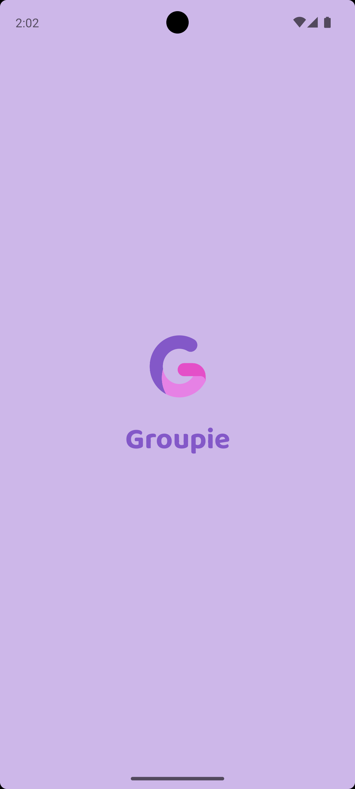
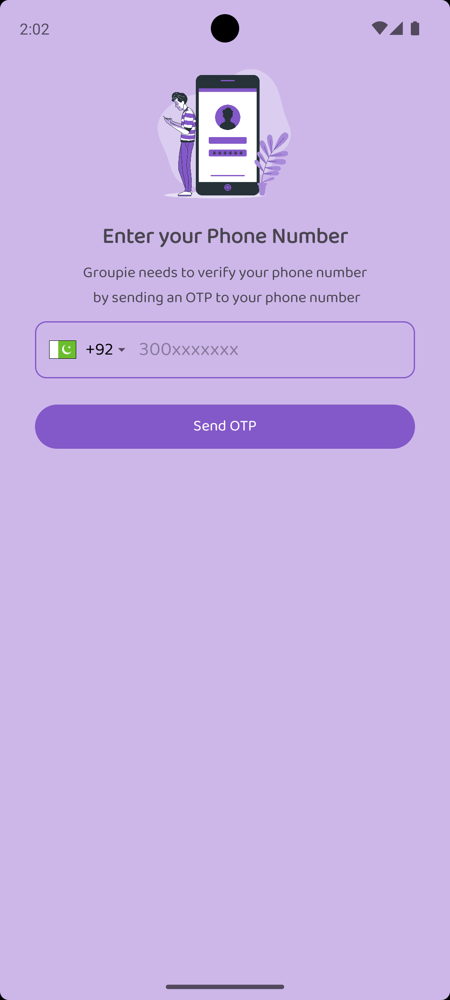
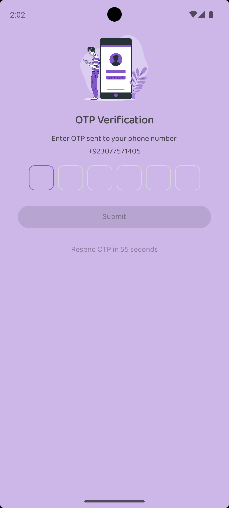
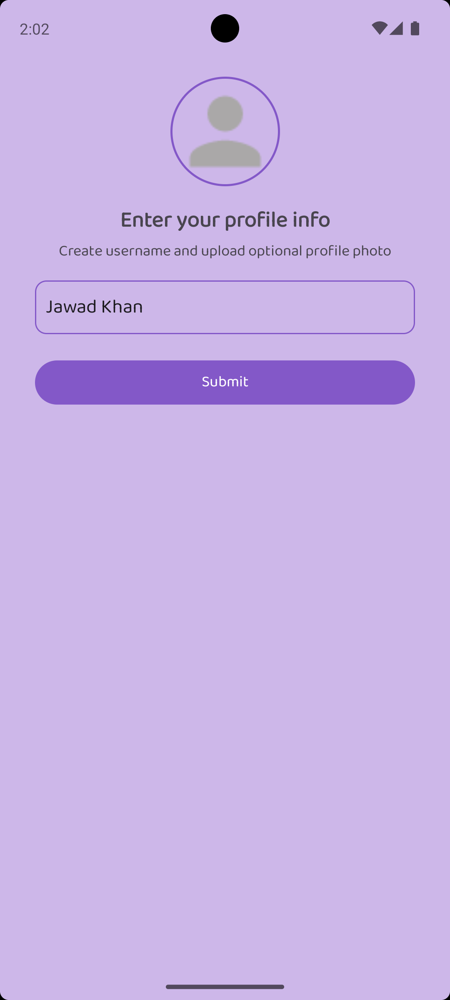
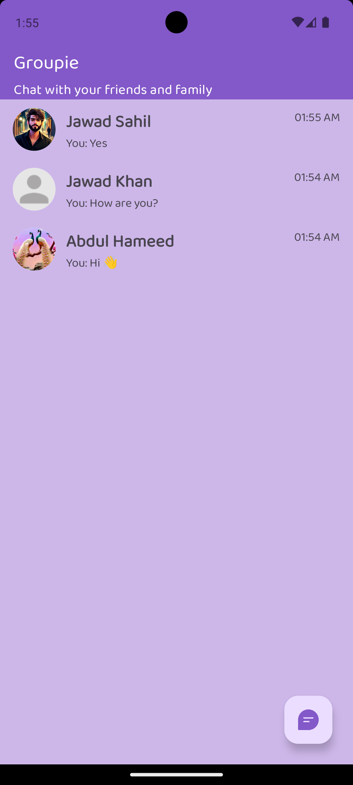
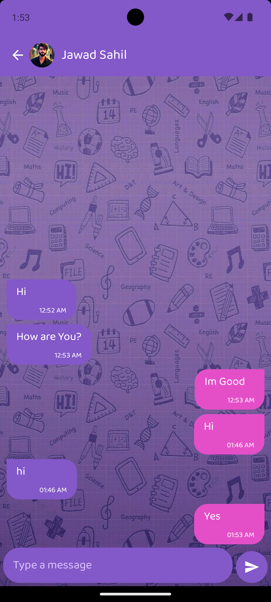

# 📱 Groupie - Firebase Chat App

**Groupie** is a real-time chat application built using **Kotlin** and **Firebase**. It allows users to sign in using their **phone number**, verify with **OTP**, create a profile with a username and image, and chat with other users by searching their usernames. The app leverages **Firebase Authentication** and **Cloud Firestore** for seamless user experience and real-time messaging.

---

## ✨ Features

- 🔐 **Secure Phone Number Authentication**
  - Sign in using your phone number.
  - OTP-based login using Firebase Authentication.

- 🌍 **Country Selection**
  - Select your country using the **Country Code Picker** library for accurate dialing codes.

- 🔢 **OTP Verification**
  - Users receive a 6-digit OTP.
  - Enter OTP with a modern UI using the **OTPView** library.

- 🧑 **User Profile Setup**
  - Set a profile picture and a unique username.
  - Profile information stored in Firebase Firestore.

- 🔎 **User Search**
  - Search other users by their username in real-time.

- 💬 **One-on-One Chat**
  - Real-time messaging between users using **Cloud Firestore**.
  - Messages are synced instantly and persist in the database.

---

## 🧱 Tech Stack

| Component              | Description                                 |
|------------------------|---------------------------------------------|
| **Language**           | Kotlin                                      |
| **Architecture**       | MVVM (optional to expand later)             |
| **Database**           | Firebase Cloud Firestore                    |
| **Authentication**     | Firebase Authentication (Phone/OTP)         |
| **Image Storage**      | Firebase Storage (for profile images)       |
| **UI Libraries**       | CountryCodePicker, OTPView, CircleImageView |

---

## 📷 Screenshots

<table>
  <tr>
    <th>Splash Screen</th>
    <th>Login Screen</th>
    <th>OTP Verification</th>
  </tr>
  <tr>
    <td></td>
    <td></td>
    <td></td>
  </tr>
  <tr>
    <th>Profile Setup</th>
    <th>Home Screen</th>
    <th>Chat Screen</th>
  </tr>
  <tr>
    <td></td>
    <td></td>
    <td></td>
  </tr>
</table>


---

## 🔧 Getting Started

### Prerequisites

- Android Studio (latest recommended)
- Firebase project with:
  - Firebase Authentication (Phone)
  - Cloud Firestore
  - Firebase Storage
- Internet connection

### Installation

1. **Clone the repository**
   ```bash
   git clone https://github.com/Jawad-Hameed-00/Groupie
